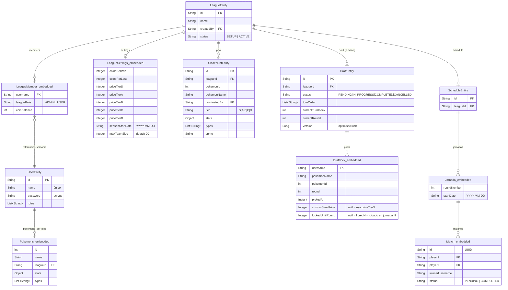
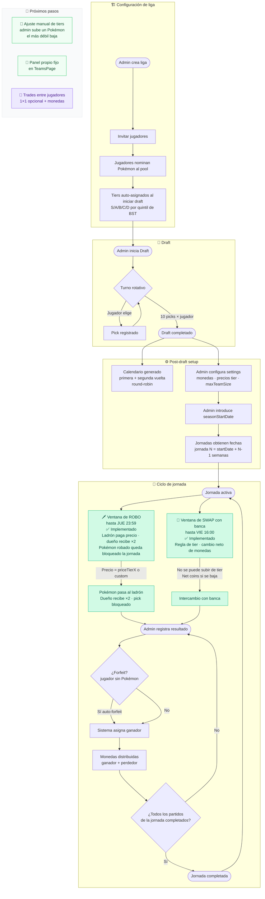

# PokeFantasy — Diagramas del proyecto

> **Cómo actualizar**: dile a Claude "actualiza los diagramas" y describe el cambio.  
> Los diagramas se renderizan directamente en GitHub (abre este archivo desde el móvil/iPad).

---

## 1. Diagrama de entidades

Las entidades en **negrita** son colecciones MongoDB independientes.  
Los bloques en _cursiva_ son documentos embebidos (no tienen colección propia).

---

## 2. Diagrama de flujo de negocio

---

## 3. Estado de implementación

| Módulo | Estado |
|--------|--------|
| Auth (registro / login / JWT) | ✅ Completo |
| Gestión de ligas (crear, miembros, roles) | ✅ Completo |
| Pool de Pokémon (nominar, tiers auto) | ✅ Completo |
| Draft (turno rotativo, 10 picks/jugador) | ✅ Completo |
| Cancelar draft / expulsar miembro | ✅ Completo |
| Equipos (TeamsPage) | ✅ Completo |
| Banca + swap 1×1 | ✅ Completo |
| Calendar round-robin (primera + segunda vuelta) | ✅ Completo |
| Registro de resultados + distribución de monedas | ✅ Completo |
| Balance de monedas por jugador (privado) | ✅ Completo |
| Jornadas con fechas + ventanas de tiempo | ✅ Completo |
| Swap de banca de pago (tier parity + net coin change) | ✅ Completo |
| Sistema de robos entre jugadores | ✅ Completo |
| **Ajuste manual de tiers por admin** | 🔲 Pendiente |
| **Panel propio fijo en TeamsPage** | 🔲 Pendiente |
| **Trades entre jugadores** | 🔲 Pendiente |

---

_Última actualización: 2026-05-21_
